@## Description

**Color picker** is a component that allows the user to select the color of another component from the pre-defined palette.

@## Appearance

### Composition

The color picker appearance varies depending on the context.

### Types of pickers and color palettes

There are two types of picker that can be used:

- Dropdown
- Plain

| Dropdown                                              | Plain                                           |
| ----------------------------------------------------- | ----------------------------------------------- |
|  |  |

A picker can have two different content types:

- Color
- Color-text

| Color                                                 | Color-text                                            |
| ----------------------------------------------------- | ----------------------------------------------------- |
|  | 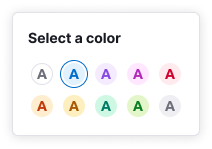 |
|     |     |

Each type can be expanded with an additional set of colors. There are two sets in total:

- standard comprising 10 colors;
- additional - also 10 colors.

| Color + More button                                                | Color + Less button                                                |
| ------------------------------------------------------------------ | ------------------------------------------------------------------ |
| 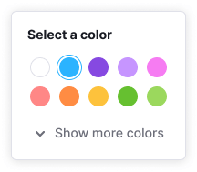 | 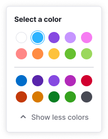 |

| Color-text + More button                                                   | Color-text + Less button                                                   |
| -------------------------------------------------------------------------- | -------------------------------------------------------------------------- |
|  | 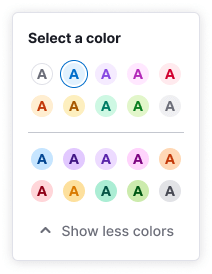 |

The Plain picker colors can be expanded in two ways:

- add an additional set to the main one as a separate row of colors;
- show via select dropdown with all the sets.

| Color 2 rows                                          | Color-text 2 rows                                           |
| ----------------------------------------------------- | ----------------------------------------------------------- |
|  |  |

| Color + Select + Dropdown                                | Color-text + Select + Dropdown                                 |
| -------------------------------------------------------- | -------------------------------------------------------------- |
| 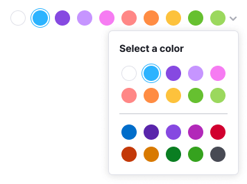 | 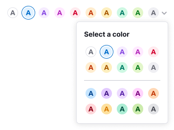 |

@## Content

### What can a Dropdown color picker consist of

|                                                                |                                                                      |
| -------------------------------------------------------------- | -------------------------------------------------------------------- |
| 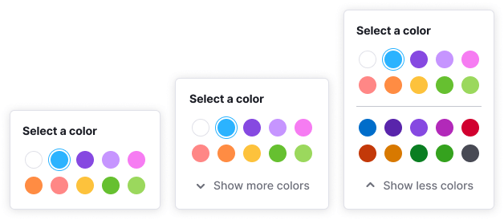 | 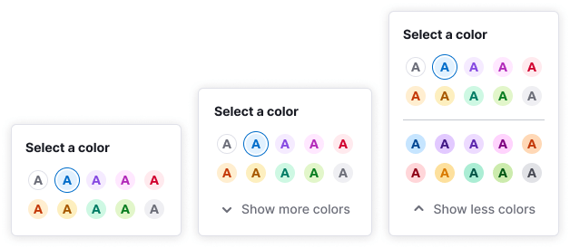 |

**Default**

- Trigger
- Dropdown that has:
  - Title
  - Set of 10 colors in two rows for the background (or for the background and text)

**Optional**

- Master expand/hide button
- Additional set of 10 colors in 2 rows

### What can Plain color picker consist of

|                                                          |                                                                |
| -------------------------------------------------------- | -------------------------------------------------------------- |
| 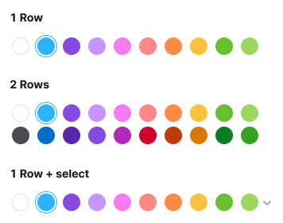 |  |

**Default** has 1 row of 10 colors.

**Optional**

- 2 rows of 10 colors
- Select that opens a dropdown with all colors

@## Triggers

Components that can call a picker:

- [Input](https://i.semrush.com/components/input/)
- [Link](https://i.semrush.com/components/link/)

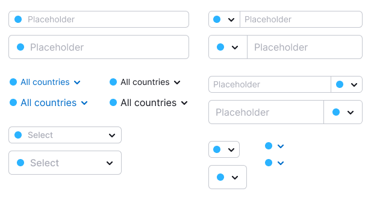

@## Where can we place the color marker?

- [Button](https://i.semrush.com/components/button/)
- [FilterTrigger](https://i.semrush.com/components/filter-trigger/)
- [Pills](https://i.semrush.com/components/pills/)
- [Select/Multiselect](https://i.semrush.com/components/select/)
- [Tabine](https://i.semrush.com/components/tab-line/)
- [TabPanel](https://i.semrush.com/components/tab-panel/)
- [Tag](https://i.semrush.com/components/tag/)
- [Option](/components/dropdown-menu/#a66af9/)

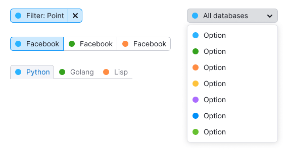

@## Mechanics and states

### Behavior

- When you hover over an unselected marker, an outline appears around it with the same color as the selected marker, and the cursor changes to pointer. When hovering over unselected markers, the selected marker still has the outline.

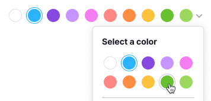

- Standard marker color in the trigger if a color is selected in the range from 1 to 8: `$asphalt: #45575c`.
  - If you select a color in the dropdown from the range of colors from 9 to 20, the color of the marker in the trigger is equal to the selected color. In the trigger, the marker has a stroke with the same color.
    
  - If a dropdown color is selected from the range of colors from 1 to 8, the marker of the selected color is duplicated in both the dropdown and plain component.
    
- If the `Plain` type is used with a select, the title is not used inside the dropdown with the palette. However, the `Plain` component itself may have an optional title. If a title is used, we recommend using the name: "Select a color".
- Dropdown closes when you click outside of its area, or when you click the trigger again.

@## Keyboard support

- When the component is focused via `Tab`, the color transition occurs sequentially — from top to bottom and from left to right. If 2 palettes are used, then when tabbed, the focus of the last element of the main palette skips to the first element of the additional palette.
- Inside the color palettes, you can navigate using the keyboard arrows.
- The color is selected by pressing `Enter`, `Space`.
- You can close the dropdown with colors using `Esc`.
- When the dropdown is closed, the focus returns to the trigger.

@## Use in UX/UI

### Dropdown color

Use it when **there is not enough space** and you need to change the color of the object/element, and:

- it doesn't have an alpha channel (non-transparent);
- it is not a background for the text;
- if you need to change the color of a text that has a white background color.

### Plain color

Use it when **there is enough space**. Or color selection is a priority for the user.

### Dropdown color-text

Use it when **there is not enough space** and you need to change the color of the object/element, and:

- it is the background for the text;
- it has an alpha channel (transparency);
- the text over it also changes color.

The text color and background color are based on the same color.

### Plain color-text

Use it when **there is enough space**. Or color selection is a priority for the user.
