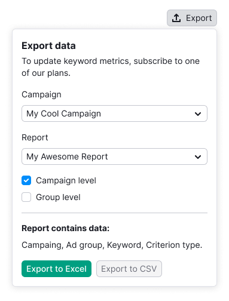

@import playground

@## Description

**Divider** is a component we use to separate content/components visually and in a semantic way.

@## Types

The divider has a secondary type, which is a dashed line. Typically, it is needed to emphasize the connection between two parts of the content. _PanelSummary is an example of this._

The color of the divider is specified in [Variables](/style/variables/#ac5b1e): `gray80`.

|        | Appearance                           | Styles                        |
| ------ | ------------------------------------ | ----------------------------- |
| solid  |    | `border: 1px solid $gray80;`  |
| dashed |  | `border: 1px dashed $gray80;` |

@## The orientation of the divider is specified in

|            | Example                                         |
| ---------- | ----------------------------------------------- |
| horizontal |  |
| vertical   |            |

@## Themes

The divider can be used either on a light or dark/colored background.

|         | Appearance                                   | Styles                                    |
| ------- | -------------------------------------------- | ----------------------------------------- |
| default |  | `border: 1px solid $gray80;`              |
| invert  |    | `border: 1px solid $gray80;` opacity: .2; |

@## Use in UX/UI

The divider can distinguish between two parts of content whether they are different or similar in meaning.

- In the first case, the divider reaches the edges of the container.

- In the second case, the divider does not reach the edges of the container.

@page divider-api
@page divider-changelog
