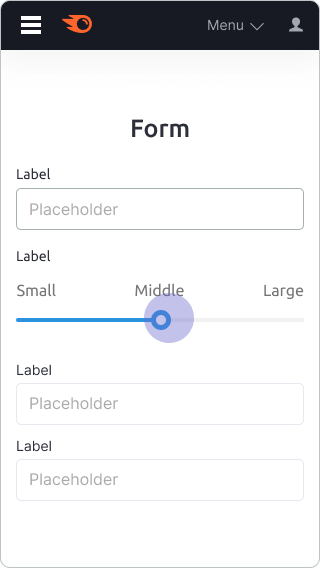

@## Description

**Slider** is a component for entering values from the available range.

In [practical point of view](https://www.nngroup.com/articles/sliders-knobs/), a slider with a large range of values instead of a few fixed parameters is considered as a continuous control because that is how it feels in the user experience.

**Use it when:**

- you need to visualize a range from which the user can select an approximate value;
- you need to additionally visualize the maximum range of the usual [InputNumber](/components/input-number/);
- the user needs to specify an approximate value (for example, a change of the color brightness).

@## Appearance

Slider consists of:

- slider knob;
- bar;
- progress bar;
- value labels (optional).

> When designing such kind of an input, keep in mind the [Akkot-Tsai law](https://en.wikipedia.org/wiki/Steering_law). It describes the dependence of the time for performing an action on the thickness and width of the horizontal control with which this action can be performed. So the larger the slider knob and the larger the bar itself, the easier and faster it is to manipulate it.

### Sizes

Default component sizes:

- `bar height — 4px`
- `knob size — 20px * 20px`

### Default styles

Default component styles:

- bar color — `#000, 0.1`
- progress and knob color — `--light-blue`

### Value labels

You can show values under the input.

> 💡 For mobile devices, show values or tooltips with values **OVER the input**. When using this component on touch devices, the values will fall under the finger when manipulating the slider knob.

@## Interaction

### States

| State        | Description                                                                                                                                    | Appearance                                                              |
| ------------ | ---------------------------------------------------------------------------------------------------------------------------------------------- | ----------------------------------------------------------------------- |
| default      | Knob size is `20px * 20px`.                                                                                                                    |                             |
| hover        | The color of the bar changes to `#000, 0.2`. The slider knob changes color to the next darkest in the palette. Change the cursor to `pointer`. |   |
| active/focus | The slider knob is scaled to `30px * 30px`. By clicking on the bar anywhere, the slider is pulled up and gets the `active` state.              |                                      |

### Linked input

The easiest way to solve the problem of entering an invalid value is to use an input next, so users can enter the exact value.

This design helps to reduce errors associated with homing (moving the hand from mouse to keyboard, and vice versa). When doing this, make sure that the keyboard shortcuts can still be used while the input has the focus state.

- If the user enters a value through an input associated with the slider, the hover is not applied to the slider. The slider knob moves depending on the value entered into the input.

| State        | Description                                                                                                 | Appearance                                           |
| ------------ | ----------------------------------------------------------------------------------------------------------- | ---------------------------------------------------- |
| active/focus | By clicking on the input, the slider knob is pulled to the corresponding value and gets the `active` state. |  |

- If the input has a maximum value, and the user entered a value greater than the maximum, show a warning tooltip with an appropriate message.

@## Use in UX/UI

### When to use the slider

This input works best in cases where the user is not interested in entering a specific value, but choosing an approximate value.

As the example above was given — changing color brightness or volume are the main cases for using slider component.

### Use on mobile devices

Consider the context of the interface. It can be difficult for a user to click and drag a control to an exact location on mobile devices. Many users accidentally move the slider knob off the value they were trying to select when they lift their finger off the screen, as NNGroup writes.

### Input values placement

Consider how the user will interact with the control. Do not place value labels under the input on mobile devices. Otherwise, when using such kind of control on mobile devices, the user will close all the values with his finger when interacting with it.

To keep the labels of such input visible when interacting with it, place them either on the left / right, or above.

@page slider-api
@page slider-code
@page slider-changelog
