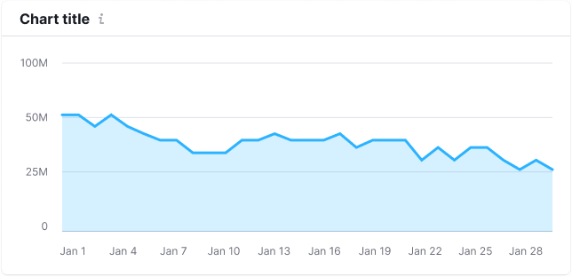
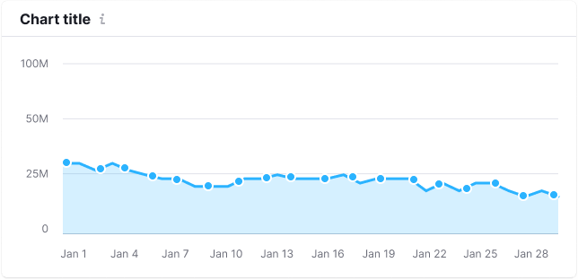
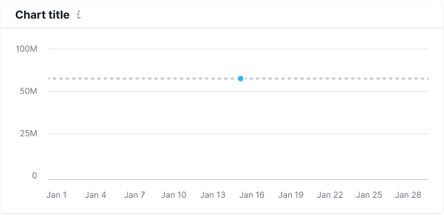
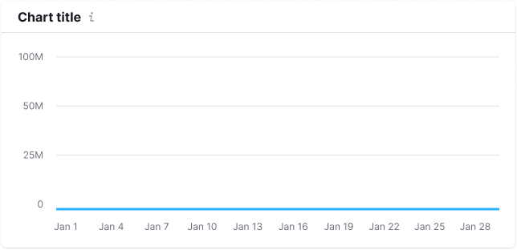
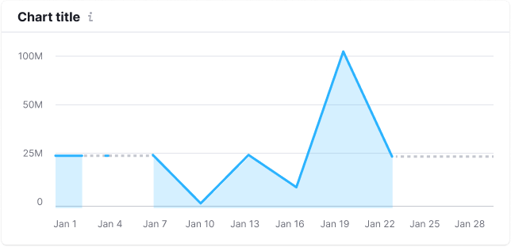

> 💡 Basic data visualization rules are described in the [Chart principles](/data-display/chart/).

@## Description

**Area chart** visualizes a trend and the ratio of quantitative indicators over a period of time. It can be used instead of [Line chart](/data-display/line-chart/) when it is important to demonstrate the ratio of parts to the whole.

**Important points to keep in mind when presenting data as an area chart:**

- A chart with areas shall be used when you need to show a larger picture of the data. _For example, line charts can be used to show the change in a population over time, while charts with areas are excellent for demonstrating the total volume of population over a time period._
- Try not to use too many values (**it is not recommended to use more than 4 values**). In such cases, it is better to use a line chart as it provides a cleaner and clearer understanding.
- Don't forget to clearly name the chart so that the axes are clear when reading the data.
- Use [Stacked area chart](/data-display/stacked-area-chart/) when, in addition to data amount, you need to display the parts to the whole ratio.

> 💡 Useful materials about line chart vs. area chart:
>
> - [Choosing the right chart type: Line charts vs Area charts](https://www.fusioncharts.com/blog/line-charts-vs-area-charts/)
> - [The Fine Line In a Gray Area: When to Use Line vs Area Charts](https://visual.ly/blog/line-vs-area-charts/)

@## Appearance

By default, we show a chart with rounded lines. This view facilitates reading the trend; this is what most people look at the chart for. For those who are interested in specific values, there is a tooltip with data for a specific point that appears when you hover over the chart.

> 💡 Add a possibility for user to select either rounded or sharp line type in the widget settings.

| Example                                             | Styles                                                                                                    |
| --------------------------------------------------- | --------------------------------------------------------------------------------------------------------- |
|  | **Line thickness is 3px**. Background color under the line is the color of the line with 0.2 transparency |

It is recommended to display the points on lines either when there are few of them (one or two), or when data collection is irregular.

| Example                                  | Styles                                                                                                                            |
| ---------------------------------------- | --------------------------------------------------------------------------------------------------------------------------------- |
|  | Point size is `16px * 16px`, `border: 2px solid $white`. When hovering, the point increases to `20px * 20px`, `margin-left: 8px`. |

@## Interaction

When you hover over the chart area, a vertical guide line is shown at the nearest point; this point is enlarged itself, and a tooltip with detailed data for the point appears next to it. For more information about the tooltip, see [Chart principles](/data-display/chart/) and [Line chart](/data-display/line-chart/).

@## Edge cases

Here you will find the states for one, two, zero, and fractional values. All other "empty states" for widgets are specified in [Error & n/a widget states](/components/widget-empty/).

@## One value

For such a chart, it is necessary to display a point, even if in the normal situation there are no points on the chart.

### Styles

- **Point size is 16px \* 16px**. When hovering, the point increases to **20px \* 20px**.
- The point is displayed on a dashed line. Color `$mist`.

@## Two values

If there are only two data points on the chart, then these two shall be displayed by connecting them with a dotted line. Do not change the range of the selected period. After the existing data points, continue the dotted line of the expected trend.

**Example 1** is for the case when there is data for two non-near dates.

**Example 2** is when there is data for two consecutive dates.

@## All values are zero

If all values on the chart are zero, then we show the trend line on the zero axis.

> **Zero is also data. 0 ≠ `n/a`.**

@## A part of the chart contains no data

Points with no data between them are connected by a dotted line. If the unknown period is at the beginning or end of the chart, then a horizontal dotted line shall be drawn.

When you hover over a point without data, the tooltip with the `n/a` value for the point shall be shown. We recommend to specify in the tooltip why there is no data, and when it will be available, if possible.

> **When there is no data, you can't draw a zero line. Zero is also data. 0 ≠ `n/a`.**

@## Initial data loading

When loading the chart for the first time, [Skeleton](/components/skeleton/) should be displayed instead of the chart.

If the chart has a title, it should be displayed during loading. The user shall have an idea of what is being loaded and whether they need to wait for the loading process to complete.

Styles can be found in the guide book for [Skeleton](/components/skeleton/).

@page area-chart-api
@page area-chart-d3-code
@page area-chart-recharts-code
