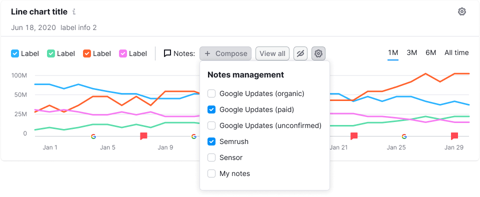

> 💡 General information on data visualization is presented in [Chart principles](/data-display/chart/).

@## Description

**Notes** is a tool for creating notes and displaying them in charts.

- Notes can be created by the user, system, or other services. You can make an unlimited number of notes for a single date.
- It is recommended to place a control for managing notes above the chart — on the left side or right side depending on the context and the controls located next to it.
- _In exceptional cases it is possible to place it under the graph._

@## Appearance

This tool has two types of being displayed.

**To mark notes, use:**

- `ChatXS` icon in color `--red` with a 1px white outline for user and system notes;
- icon with the logo of the corresponding service with a white border 1px, if the note is generated by a third-party service.

There may be a 10px counter inside the note icon, which is visible when you hover over the icon.

@## Compact (in dropdown menu)

In this form, all Notes settings are hidden in the dropdown menu, where you can enable/disable the display of notes on the chart, add a note, and change other settings.

@## Advanced

If there is enough space next to the chart and to the extend that this is required for the user's main tasks, all the main controls for managing notes can be removed from the dropdown.

In any case, it is better to hide additional settings in the settings button, so as not to overload the chart.

@## Interaction

- **When hovering over the note icon on the chart axis, the icon is increased in size by two times.**
- `ChatXS` increases to the size of the `ChatM` icon.

When clicking on the `+ Add` or `+ Add note` button, a modal window opens with the inputs for entering note parameters.

> For more information about other controls that can be placed next to charts please see [Chart controls](/data-display/chart-controls/).
