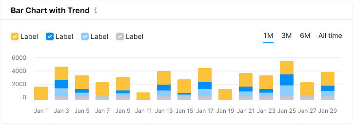
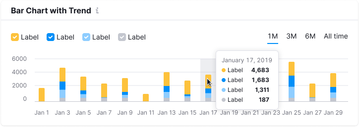
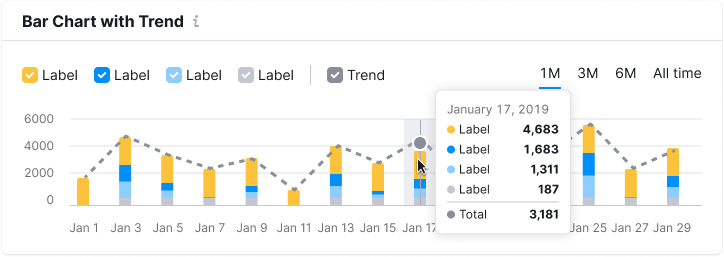

> 💡 Basic data visualization rules are described in the [Chart principles](/data-display/chart/).

@## Description

This type of bar graphs can be used if it is necessary to display more than two values and show the ratio of parts to the whole.

Important points to keep in mind when presenting data as a `stacked bar chart`:

- Use this chart type if you have more than two values to compare.
- Use this chart type to visualize the ratio of parts to the whole.
- Use sufficiently contrasting colors to show different parts more clearly.
- Don't make this chart too small in height and width – it will make it harder to read data inside such a chart.

@## Appearence

Stacked bar chart has no margin between values inside the column. **Choose contrasting colors for different categories.**

> It is recommended to make a minimum 20% margin between a group of columns. This is necessary so that the data does not turn into mush.

### Chart colors

Use [special chart palette](/style/color/) and follow the rules prescribed for it.

@## Interaction

When you hover over a column, we highlight it with a grey background – `rgba 152 170 175, 0.3` (`$mist` with .3 opacity). The hover takes up half of the margin column on the right and left sides.

> 💡 If the column is clickable, the cursor must change to `pointer`.

See detailed information in the common [Bar chart guide](/data-display/bar-chart/#a61ee5).

@## Trend

In some cases, a stacked bar chart may have a trend line. Most often, this component overload such charts. However, in some cases, it can be useful for reading the overall trend. It helps to focus on the total value of each point.

When you hover over any part of the column, the tooltip shall display the values for all components and the total value.

@## Edge cases

Edge cases for stacked bar chart are pretty much the same as [Bar chart](/data-display/bar-chart/bar-chart-vertical/#a54381) has.

@## Data loading

See detailed information in the section about data loading in the [Bar chart guide](/data-display/bar-chart/bar-chart-vertical/#ac26f2).

@## Use in UX/UI

See detailed information in the [Bar chart guide](/data-display/bar-chart/#a1d837).

@page stacked-bar-chart-api
@page stacked-bar-chart-d3-code
@page stacked-bar-chart-recharts-code
