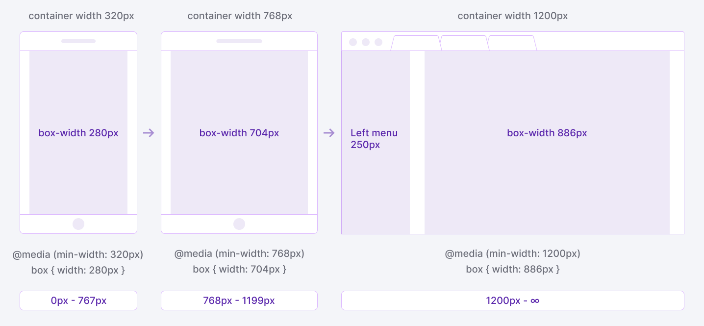

@## Description

- The layout of the page depends on the breakpoint.
- Each range determines the number of columns, maximum content width, main container margins and text sizes.
- **You can set your own breakpoints, if it's necessary for the correct display of the interface in a particular case. _For example, change a breakpoint for desktop screens._**

> 💡 After 1199px, the left menu appears and, with its width of 250px, "eats away" space from the product page 🙃

| Breakpoint                      | Columns | Gutter | Max. content width                                                               | Content wrapper margins | Layout scheme                                             | Description                                                                                                               |
| ------------------------------- | ------- | ------ | -------------------------------------------------------------------------------- | ----------------------- | --------------------------------------------------------- | ------------------------------------------------------------------------------------------------------------------------- |
| **min-width: 320px** (320-767)  | 4       | 24px   | We recommend setting it to 500px. But you can choose another value if necessary. | `margin: 80px 20px;`    |              | **Mobile & tablet devices**. The content has a one-column structure. The left menu is hidden.                             |
| **min-width: 768px** (768-1199) | 6       | 24px   | We recommend setting it to 720px. But you can choose another value if necessary. | `margin: 120px 32px;`   |              | **Mobile & tablet devices**. You can arrange the content as a two-column structure. The left menu is hidden.              |
|                                 |         |        |                                                                                  |                         |    | **Mobile & tablet devices (landscape mode)**. The content is arranged as a two-column structure. The left menu is hidden. |
| **min-width: 1200px** (1200-∞)  | 12      | 24px   | 840px for product landing pages. **956px for product pages.**                    | `margin; 0 auto;`       |          | **Tablet & desktop devices**. The left menu is open. You can rearrange the content as a three-column structure.           |
|                                 |         |        |                                                                                  |                         |  | **Tablet (landscape mode)**. The left menu is open. You can rearrange the content as a three-column structure.            |

@## Product pages width

The grid system is based on the left menu width (250px) and the maximum content width of our product pages.

> The maximum width of the content area on the product landing pages is 840px. If your product visually differs from the core Semrush products, then, of course, your maximum width may differ.

@page grid-api
@page grid-code
@page grid-changelog
