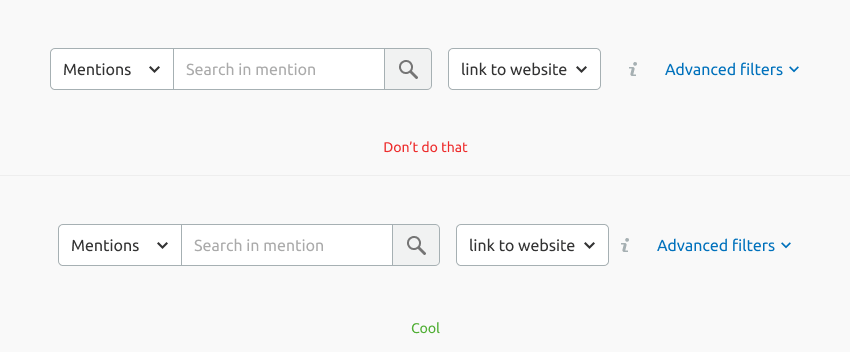

@## Description

**Informer** is a pattern used for visual marking of hints in the interface.

It is required when there is no space or possibility to put, for example, [hint link](/style/typography/) next to the component.

@## Appearance

The informer consists of:

- an icon of the desired size (left padding 4px);
- a [tooltip](/components/tooltip/) with information (appears when you hover over the icon).

> 💡 The Info icon shouldn't be used with the h1 title. This is generally the header of hero blocks, etc. Hiding them in an info icon is strange, isn't it? 😎

| Size | Appearance                                 | Use                                                                                                                    |
| ---- | ------------------------------------------ | ---------------------------------------------------------------------------------------------------------------------- |
| M    |      | Used only with the largest titles – h2 (`--fs-700`) and h3 (`--fs-600`), text of size from 33px, XL components (42px). |
|      |                                            |                                                                               |
| S    |      | Used only with h4 and text of size 25px (`--fs-500`), and L components (32px).                                         |
|      |                                            |                                                                               |
| XS   |    | Used next to widget headings, tables, and components of size M (26px).                                                 |
|      |                                            |                                                                             |
| XXS  |  | Used only inside `Options` next to the text.                                                                           |
|      |                                            |                                                                           |

@## Interaction

|        | Appearance example                           | Styles                                                                          |
| ------ | -------------------------------------------- | ------------------------------------------------------------------------------- |
| normal |      | `background-color: $stone;`                                                     |
| hover  |  | The icon color doesn't change on hover. Only cursor changes to `cursor: help;`. |

@## Click zone

| Icon size | The size of the click zone                        |
| --------- | ------------------------------------------------- |
| M         | `30px * 30px`                                     |
|           |      |
| S         | `24px * 24px`                                     |
|           |      |
| XS        | `20px * 20px`                                     |
|           |    |
| XXS       | `16px * 16px`                                     |
|           |  |

@## The tooltip

About the tooltip you can check in the [Tooltip](/components/tooltip/).

@## Use in UX/UI

If the `Info` icon hides additional information about the control in a group of controls (for example, it occurs in filters and formats), then pay attention to margins and don’t forget about [rules of external and internal proximity](https://bureau.ru/bb/soviet/20140818/).

In the case when controls have text labels, the `Info` icon should be placed next to the labels.

@page informer-code
